# Airline Schedule Management System - Entity Relationship Diagram

## Database Schema ERD

```mermaid
erDiagram
    %% Core Schedule Tables
    schedules ||--o{ flights : "contains"
    schedules ||--o{ schedule_workflows : "processed_by"
    schedules ||--o{ schedule_publications : "published_as"

    flights ||--o{ flight_legs : "has"
    flights ||--o{ schedule_changes : "tracked_in"
    flights ||--o{ airport_slots : "allocated_to"
    flights ||--o{ publication_flights : "published_in"

    ssm_messages ||--o{ schedule_changes : "triggers"
    ssm_messages ||--o{ schedule_workflows : "initiates"

    %% Constraint & Validation Tables
    airport_slots }o--|| distribution_channels : "managed_by"
    airport_constraints }o--|| minimum_connect_times : "defines"
    aircraft_availability }o--|| flights : "assigned_to"
    crew_bases }o--|| flights : "staffs"

    %% Workflow & Agent Tables
    schedule_workflows ||--o{ agent_executions : "executes"
    schedule_workflows ||--o{ schedule_conflicts : "detects"
    schedule_workflows ||--o{ agent_communications : "logs"
    schedule_workflows ||--o{ workflow_approvals : "requires"

    agent_executions ||--o{ agent_communications : "sends"
    schedule_conflicts }o--|| agent_executions : "resolved_by"

    %% Distribution & Publishing Tables
    distribution_channels ||--o{ schedule_publications : "publishes_to"
    distribution_channels ||--o{ distribution_subscriptions : "has"
    distribution_channels ||--o{ distribution_logs : "logs"

    schedule_publications ||--o{ publication_flights : "contains"
    schedule_publications ||--o{ publication_confirmations : "confirmed_by"
    schedule_publications ||--o{ distribution_logs : "logs"

    %% Entity Definitions

    schedules {
        uuid schedule_id PK
        varchar season_code "W25, S25"
        date effective_from
        date effective_to
        integer version_number
        enum status "draft|published|active|superseded|cancelled"
        varchar created_by
        timestamp created_at
        timestamp updated_at
        jsonb metadata
    }

    flights {
        uuid flight_id PK
        uuid schedule_id FK
        varchar flight_number "CM101"
        varchar carrier_code "IATA code"
        varchar origin_airport "PTY"
        varchar destination_airport "MIA"
        time departure_time
        time arrival_time
        integer departure_day_offset
        integer arrival_day_offset
        varchar operating_days "1234567"
        date effective_from
        date effective_to
        varchar aircraft_type "738, 32N"
        enum service_type "J|F|C|H"
        integer frequency_per_week
        varchar aircraft_registration
        timestamp created_at
        timestamp updated_at
        jsonb metadata
    }

    flight_legs {
        uuid leg_id PK
        uuid flight_id FK
        integer leg_sequence
        varchar departure_airport
        varchar arrival_airport
        time departure_time
        time arrival_time
        integer departure_day_offset
        integer arrival_day_offset
        interval block_time
        integer distance_nm
        varchar aircraft_registration
    }

    ssm_messages {
        uuid message_id PK
        enum message_type "NEW|CNL|CON|TIM|EQT"
        enum message_format "SSM|SSIM|JSON|XML"
        text raw_message
        jsonb parsed_data
        varchar sender_airline
        varchar receiver_airline
        varchar action_code
        timestamp received_at
        timestamp processed_at
        enum processing_status
        jsonb validation_errors
        uuid_array affected_flight_ids
        varchar created_by_agent
    }

    schedule_changes {
        uuid change_id PK
        uuid flight_id FK
        enum change_type "create|update|cancel|reinstate"
        varchar field_name
        text old_value
        text new_value
        text reason
        varchar changed_by
        timestamp changed_at
        uuid ssm_message_id FK
    }

    airport_slots {
        uuid slot_id PK
        varchar airport_code "IATA"
        timestamp slot_time
        enum slot_type "arrival|departure"
        integer tolerance_before_minutes
        integer tolerance_after_minutes
        varchar allocated_to_airline
        uuid allocated_to_flight FK
        varchar slot_season
        varchar slot_series
        boolean historical_rights
        jsonb usage_history
        boolean confirmed
        varchar coordinator_reference
    }

    airport_constraints {
        uuid constraint_id PK
        varchar airport_code
        enum constraint_type "curfew|capacity|slot_coordination|mct"
        varchar constraint_name
        jsonb constraint_data
        date effective_from
        date effective_to
        boolean is_mandatory
        enum coordination_level "level_1|level_2|level_3"
    }

    aircraft_availability {
        uuid availability_id PK
        varchar aircraft_registration
        varchar aircraft_type
        varchar owner_airline
        varchar operating_airline
        varchar home_base
        timestamp available_from
        timestamp available_to
        enum status "available|maintenance|grounded"
        varchar maintenance_type
        date next_maintenance_date
        boolean etops_certified
        integer etops_minutes
        jsonb route_restrictions
    }

    minimum_connect_times {
        uuid mct_id PK
        varchar airport_code
        varchar from_terminal
        varchar to_terminal
        enum connection_type
        integer mct_minutes
        boolean requires_security_recheck
        boolean requires_customs
        date effective_from
        date effective_to
    }

    crew_bases {
        uuid base_id PK
        varchar base_code
        varchar base_name
        varchar airport_code
        varchar airline_code
        boolean has_pilots
        boolean has_cabin_crew
        integer pilot_capacity
        integer cabin_crew_capacity
        boolean is_active
    }

    schedule_workflows {
        uuid workflow_id PK
        enum workflow_type "weekly_update|ad_hoc_change|seasonal_planning"
        varchar workflow_name
        uuid schedule_id FK
        uuid_array ssm_message_ids
        varchar initiated_by
        timestamp initiated_at
        timestamp completed_at
        enum status "pending|in_progress|completed|failed"
        varchar current_agent
        integer total_steps
        integer completed_steps
        decimal progress_percentage
        integer conflicts_detected
        integer conflicts_resolved
        jsonb workflow_metadata
    }

    agent_executions {
        uuid execution_id PK
        uuid workflow_id FK
        varchar agent_name "SSMParserAgent, ValidationAgent..."
        varchar agent_version
        integer execution_sequence
        timestamp started_at
        timestamp completed_at
        bigint execution_time_ms
        enum status "queued|running|completed|failed|skipped"
        jsonb input_data
        jsonb output_data
        jsonb decisions_made
        integer tokens_used
        text error_message
        boolean validation_passed
        jsonb validation_errors
    }

    schedule_conflicts {
        uuid conflict_id PK
        uuid workflow_id FK
        enum conflict_type "aircraft_overlap|crew_unavailable|slot_conflict"
        enum severity "critical|high|medium|low"
        uuid_array affected_flight_ids
        varchar detected_by_agent
        timestamp detected_at
        text conflict_description
        jsonb conflict_data
        enum resolution_status "pending|in_progress|resolved"
        jsonb proposed_solutions
        jsonb resolution_details
        varchar resolved_by
        timestamp resolved_at
    }

    agent_communications {
        uuid communication_id PK
        uuid workflow_id FK
        uuid execution_id FK
        varchar from_agent
        varchar to_agent
        varchar message_type "request|response|notification"
        jsonb message_content
        timestamp sent_at
        timestamp processed_at
        varchar status "sent|received|processed"
    }

    workflow_approvals {
        uuid approval_id PK
        uuid workflow_id FK
        varchar approval_type
        text approval_description
        jsonb approval_data
        varchar requested_by
        timestamp requested_at
        varchar status "pending|approved|rejected"
        varchar approved_by
        timestamp approved_at
    }

    distribution_channels {
        uuid channel_id PK
        varchar channel_code
        varchar channel_name
        enum channel_type "GDS_AMADEUS|GDS_SABRE|OTA_EXPEDIA"
        varchar endpoint_url
        enum preferred_format "SSIM|SSM|JSON|XML"
        enum subscription_tier "real_time|hourly|daily|weekly"
        boolean is_active
        timestamp last_successful_publish
        integer consecutive_failures
    }

    schedule_publications {
        uuid publication_id PK
        uuid schedule_id FK
        uuid channel_id FK
        uuid workflow_id FK
        varchar publication_type
        enum payload_format "SSIM|SSM|JSON|XML"
        bigint payload_size_bytes
        integer total_flights
        uuid_array flight_ids
        timestamp published_at
        timestamp confirmed_at
        enum status "pending|published|failed"
        boolean confirmation_received
        varchar confirmation_code
        integer retry_count
    }

    publication_flights {
        uuid pub_flight_id PK
        uuid publication_id FK
        uuid flight_id FK
        enum status
        varchar channel_flight_id
        boolean confirmed
        timestamp confirmed_at
    }

    distribution_subscriptions {
        uuid subscription_id PK
        uuid channel_id FK
        varchar subscriber_name
        enum subscription_tier
        varchar_array filter_carrier_codes
        varchar_array filter_airports
        jsonb filter_criteria
        enum delivery_format
        boolean is_active
        integer total_deliveries
        integer successful_deliveries
    }

    publication_confirmations {
        uuid confirmation_id PK
        uuid publication_id FK
        varchar confirmation_type "ACK|NAK"
        varchar confirmation_code
        timestamp received_at
        integer flights_confirmed
        integer flights_rejected
        jsonb rejection_reasons
    }

    distribution_logs {
        uuid log_id PK
        uuid publication_id FK
        uuid channel_id FK
        varchar log_level "DEBUG|INFO|WARNING|ERROR"
        text log_message
        varchar log_category
        integer http_status_code
        bigint response_time_ms
        timestamp logged_at
    }

    regulatory_requirements {
        uuid requirement_id PK
        varchar country_code "ISO 3166-1"
        varchar requirement_type
        varchar requirement_name
        jsonb compliance_data
        date effective_from
        date effective_to
        varchar regulatory_authority
    }
```



## Table Groups

### 1. Core Schedule Management
- `schedules` - Seasonal schedule containers
- `flights` - Individual flight operations
- `flight_legs` - Multi-segment flight details
- `ssm_messages` - IATA SSM message log
- `schedule_changes` - Complete audit trail

### 2. Constraints & Validation
- `airport_slots` - Airport slot allocations (IATA WSG)
- `airport_constraints` - Operational constraints (curfews, capacity)
- `aircraft_availability` - Fleet availability tracking
- `minimum_connect_times` - MCT requirements
- `crew_bases` - Crew base locations
- `regulatory_requirements` - Compliance tracking

### 3. Multi-Agent Workflow
- `schedule_workflows` - Master workflow orchestration
- `agent_executions` - Individual agent execution logs
- `schedule_conflicts` - Detected conflicts
- `agent_communications` - Inter-agent messaging
- `workflow_approvals` - Human-in-the-loop approvals

### 4. Distribution & Publishing
- `distribution_channels` - GDS/OTA channel config
- `schedule_publications` - Publication tracking
- `publication_flights` - Granular flight-level tracking
- `distribution_subscriptions` - Partner subscriptions
- `publication_confirmations` - ACK/NAK tracking
- `distribution_logs` - Detailed activity logs

## Key Relationships

1. **Schedule → Flights**: One schedule contains many flights
2. **Flights → Slots**: Each flight requires airport slots
3. **Workflows → Agents**: Workflows execute multiple agents
4. **Conflicts → Resolution**: Conflicts are detected and resolved by agents
5. **Schedules → Publications**: Schedules are published to multiple channels
6. **SSM Messages → Changes**: SSM messages trigger schedule changes

## Indexes Strategy

### High-Performance Queries
- Flight lookups by carrier/number
- Daily operations by date and airport
- Workflow status monitoring
- Conflict resolution tracking
- Publication status by channel

### JSONB Indexes (GIN)
- `ssm_messages.parsed_data`
- `schedule_conflicts.proposed_solutions`
- `distribution_subscriptions.filter_criteria`
- `agent_executions.decisions_made`

## Data Flow

```
SSM Message Received
  ↓
SSMParserAgent parses message
  ↓
ScheduleValidationAgent validates
  ↓
ConflictResolutionAgent detects conflicts
  ↓
FleetAssignmentAgent optimizes aircraft
  ↓
CrewFeasibilityAgent validates crew
  ↓
SlotComplianceAgent validates slots
  ↓
DistributionAgent publishes to GDS/OTA
  ↓
Confirmations tracked and logged
```

## IATA Standards Compliance

- **SSM (Standard Schedule Message)**: Message types NEW, CNL, TIM, EQT, etc.
- **SSIM (Standard Schedules Information Manual)**: Format for schedule distribution
- **WSG (Worldwide Slot Guidelines)**: Slot allocation and historical rights
- **MCT (Minimum Connect Time)**: Connection time requirements
- **Day Pattern**: 1234567 format (1=Mon, 7=Sun, X=Not operating)

## PostgreSQL Features Used

- UUID primary keys for distributed systems
- JSONB for flexible metadata storage
- Array types for multi-value fields
- ENUMs for type safety
- Triggers for automated updates
- Views for common queries
- Advanced indexes (B-tree, GIN)
- Temporal data types (TIMESTAMP WITH TIME ZONE)

